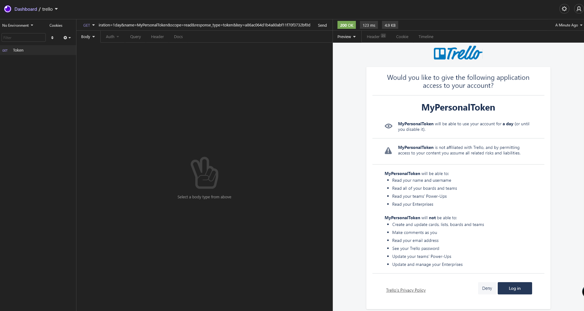
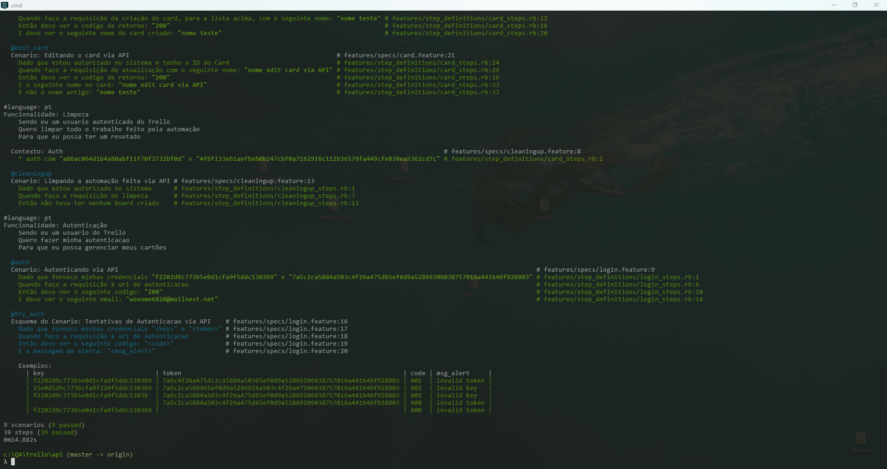
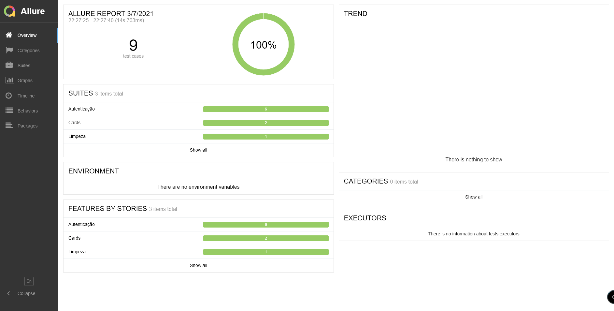

<div align="center">


<br/>
<br/>
<a href="https://www.linkedin.com/in/asilvadev/">

</a>

</div>
<br/>

## 👨🏽‍💻 Technologies

<p align="left">

<br/>


<br/>


</P>
<br/>

## ⚠️ Informação importante

```
Os testes foram feitos com as credenciais abaixo.
Caso deseje realizar os testes com uma conta pessoal, gere sua key e token pelo link: https://trello.com/app-key
(Siga os passos e substitua nas credenciais abaixo dentro do projeto)

key: a86ac064d1b4a80abf11f70f3732bf0d
token: 4f6f133e61aefbeb0b247cbf0a7162916c112b36579fa449cfe038ea5362cd7c
```

```
Por padrão os testes rodam via cucumber em chrome_headless

https://chromedriver.chromium.org/downloads
```

```
Desafio:
→ O usuário deve realizar a autenticação no Trello APIs (obter token de acesso).
→ O usuário deve criar um card e editar esse card.
→ O usuário deve excluir esse card e também as sujeiras geradas por esta automação.
```

## 🛠️ Steps


```
git clone https://github.com/asilvadev/trello-sensedia.git
```

## 📷 Screenshots

```
A imagem mostra o requisição feia por um software de testes de API
~Então o Token Trello é necessario ser gerado manualmente
```



```
↓ Cucumber output via terminal ↓
```



↓ Para gerar o resport no Allure ↓

```ts
allure serve logs\
```



##
